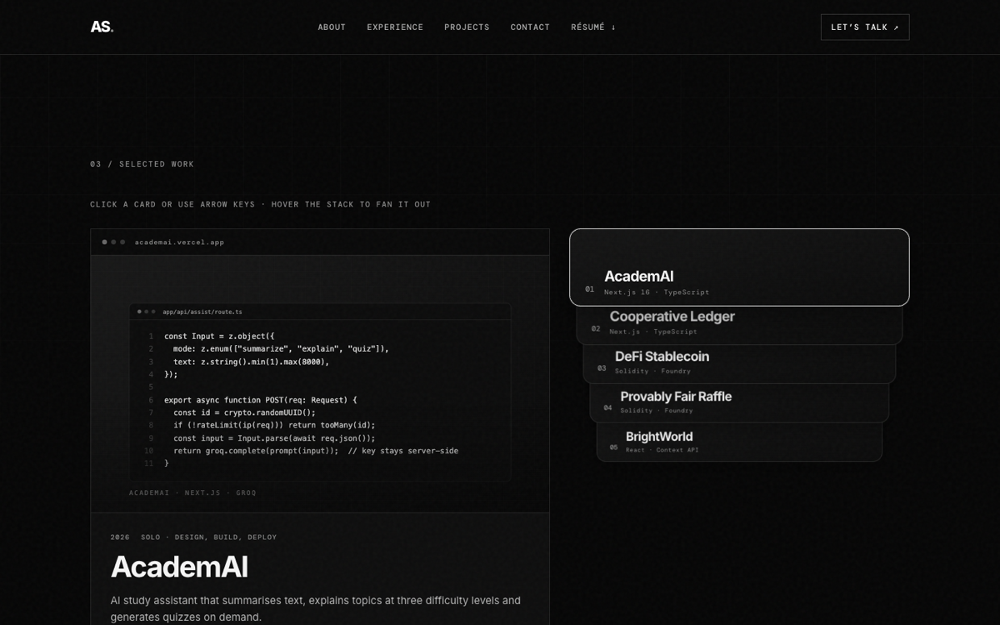

# Al-Amin Sanusi — Portfolio

[](https://github.com/agent-mino/Sanusi-Al-amin-Portfolio/actions/workflows/ci.yml)

**Live:** https://sanusi-al-amin.vercel.app

A black-and-white, single-page portfolio built with React 19 and Vite. Its centrepiece is an interactive
project showcase: a browser-style preview panel paired with a wallet-style card stack.



## Built with

- **React 19 + Vite 6**: components with content kept in plain data files
- **Hand-written CSS**: design tokens, no framework, no runtime CSS-in-JS
- **@fontsource**: self-hosted Inter and DM Mono (no third-party font requests)
- **ESLint + GitHub Actions**: lint and production build on every push and PR

## Highlights

- **Accessible by default:** WCAG AA colour contrast, skip link, visible focus states, keyboard-operable card
  stack (click or ←/→), a polite live region for project changes and `prefers-reduced-motion` support.
- **No layout jank:** stack order lives in state separate from DOM order, so cards animate with CSS
  transforms and keep keyboard focus.
- **Shareable:** Open Graph/Twitter cards, JSON-LD `Person` schema, canonical URL, sitemap and robots.txt.

## Structure

```
src/
  App.jsx                 page composition
  components/             Nav, Hero, Experience, ProjectShowcase, Contact, …
  data/site.js            profile, experience, skills, education
  data/projects.js        project cards (summary, stack, highlights, links)
  hooks/useReveal.js      IntersectionObserver scroll reveal
  styles/                 base (tokens, nav, utilities) · sections · projectShowcase
public/
  projects/               project covers (SVGs generated by `npm run covers`)
  og-image.png            1200×630 social preview
```

## Scripts

```bash
npm install
npm run dev      # local dev server
npm run lint     # ESLint
npm run build    # production build → dist/
npm run preview  # serve the build
npm run covers   # regenerate the code-snippet project covers
```

Deploy on Vercel with build command `npm run build` and output directory `dist`.
